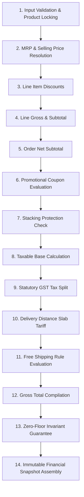

# Billing Engine & Pricing Calculation Pipeline

## 1. Overview
The **Billing Engine** (`BillingService` in `apps.commercial_config.services`) executes an authoritative, deterministic 14-step billing pipeline for all retail checkout and order placement flows in the Vee Power Electricals platform. 

The calculation pipeline runs entirely server-side using fixed-point `Decimal` arithmetic. It never relies on calculations performed by the frontend client.

---

## 2. The 14-Step Calculation Pipeline

### Sequence Details:
1. **Validate Products & Quantities**: Validates catalog items exist, are marked `active=True`, and have positive integer quantities requested.
2. **Resolve Selling Prices**: Resolves current selling price and MRP per product line.
3. **Resolve Applicable Product Discounts**: Computes per-unit savings (`mrp - price`).
4. **Calculate Line Amounts**: Multiplies selling unit price by requested quantity, quantized to `Decimal('0.01')` using `ROUND_HALF_UP`.
5. **Calculate Order Subtotal**: Aggregates `net_subtotal` across all line items.
6. **Resolve Order-Level Discount**: Evaluates active coupon codes against `min_order_value`, validity dates, and active flags via `DiscountService`.
7. **Apply Stacking Rules**: Verifies combined product + order discounts do not exceed the configured 50% maximum combined discount limit.
8. **Calculate Taxable Amount**: Computes net taxable base: `max(0, net_subtotal - order_discount)`.
9. **Calculate Statutory GST**: Resolves applicable tax mode (`TAX_EXCLUSIVE` or `TAX_INCLUSIVE`) and calculates CGST/SGST/IGST breakdown via `TaxService`.
10. **Resolve Delivery Tariff**: Resolves distance slab tariff from Coimbatore hub via `DeliveryService`.
11. **Apply Free Delivery Rule**: If taxable subtotal exceeds `free_delivery_threshold`, final delivery fee is zeroed out and a shipping discount is recorded.
12. **Calculate Final Total**: Sums taxable amount, statutory GST, and final delivery fee.
13. **Zero-Floor Guarantee**: Enforces non-negative total invariant.
14. **Assemble Calculation Snapshot**: Compiles an immutable JSON dictionary capturing all configuration parameters, tax rates, slab rules, and calculations at that instant in time.

---

## 3. Strict Decimal Precision & Zero Float Rule
- All currency calculations use `Decimal` with 2 decimal places (`Decimal('0.01')`) and `ROUND_HALF_UP`.
- Floating-point arithmetic (`float`) is strictly prohibited across pricing, tax, discounts, delivery fees, and order/invoice totals.

---

## 4. Historical Snapshot Rules
- The order record stores a frozen `calculation_snapshot` JSON dictionary on `orders.calculation_snapshot`.
- When future catalog prices, distance tariff slabs, or GST statutory rates change in the database, existing orders and invoices remain completely unaffected.
