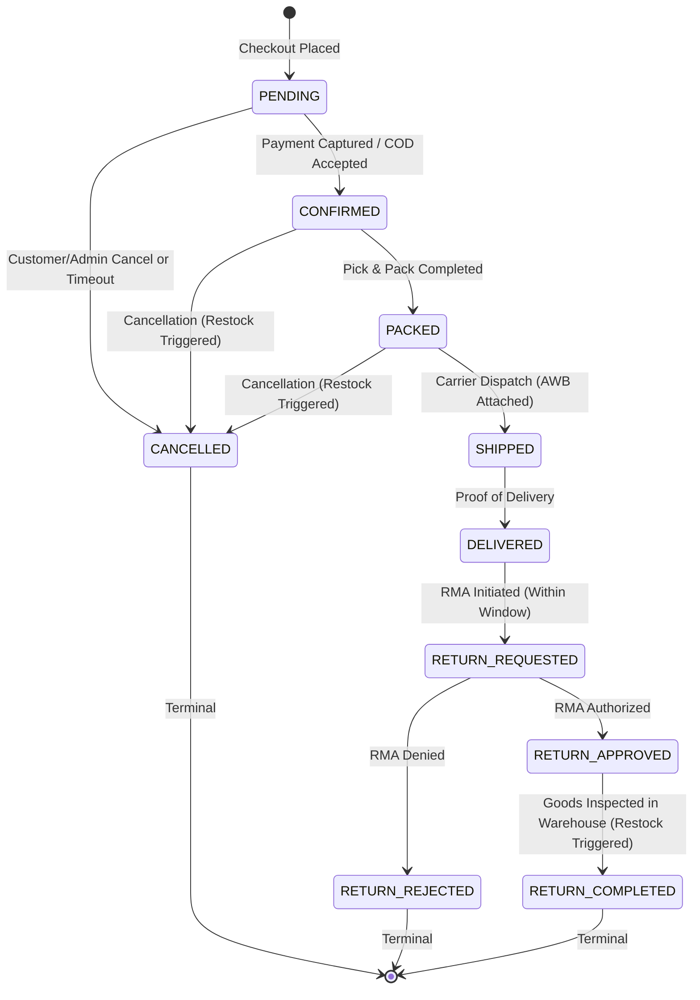

# Order Workflow Engine & Finite State Machine (FSM)

## 1. Overview
The **Order Workflow Engine** (`OrderWorkflowService` and `CheckoutService` in `apps.orders.services`) enforces the canonical 10-state finite state machine (FSM) documented in `backend/docs/order-state-machine.md`.

---

## 2. Canonical 10-State Transition Matrix

---

## 3. Physical Inventory Side Effects per State Transition

| State Transition | Authorized Actor | Physical Stock Impact | Audit Record |
|---|---|---|---|
| `[*] -> PENDING` | Customer | Decremented at checkout (`SALE` transaction) | Initial `OrderStatusHistory` |
| `PENDING -> CONFIRMED` | System / Admin | None (already decremented at checkout) | Logged |
| `CONFIRMED -> PACKED` | Warehouse Staff | None | Logged |
| `PACKED -> SHIPPED` | Logistics / Staff | Requires `tracking_number` (AWB) | Logged |
| `SHIPPED -> DELIVERED` | Courier / Admin | None | Logged |
| `* -> CANCELLED` | Customer / Admin | **Restored exactly once** (`RETURN` transaction) | Logged with reason |
| `DELIVERED -> RETURN_REQUESTED` | Customer | None | Logged |
| `RETURN_REQUESTED -> RETURN_APPROVED` | Staff | None | Logged |
| `RETURN_REQUESTED -> RETURN_REJECTED` | Staff | None | Logged with rejection note |
| `RETURN_APPROVED -> RETURN_COMPLETED` | Warehouse Admin | **Restored upon physical inspection** (`RETURN` transaction) | Logged |

---

## 4. Forbidden Transitions
The state machine strictly prevents illegal transitions:
1. `SHIPPED -> CANCELLED`: Forbidden. In-transit parcels must follow return/RTO protocol.
2. `DELIVERED -> CANCELLED`: Forbidden. Delivered goods must enter the RMA `RETURN_REQUESTED` workflow.
3. `CANCELLED -> Any State`: Forbidden. Terminal state.
4. `RETURN_COMPLETED -> Any State`: Forbidden. Terminal state.
5. `PENDING -> DELIVERED`: Forbidden. Cannot bypass packing and carrier dispatch stages.

---

## 5. Transaction Safety & Auditing
- Every transition executes within `transaction.atomic()`.
- The order row is locked with `select_for_update()`.
- Every transition appends an immutable entry to `order_status_history` recording `previous_status`, `new_status`, `changed_by`, `reason`, and timestamp.
