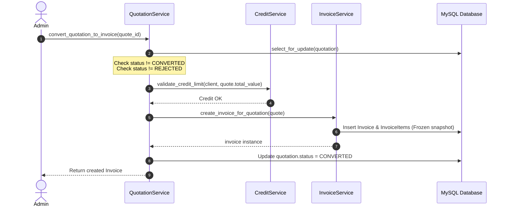

# Quotation → Invoice Conversion & Financial Invoicing

## 1. Overview
The commercial contract pipeline connects corporate contractor estimates (`Quotation`) to legal GST tax invoices (`Invoice`) via domain services (`QuotationService`, `InvoiceService`, `CreditService` in `apps.finance.services`).

---

## 2. Acyclic Database Relation Architecture
Following the Phase 2/Phase 2.1 schema reconciliation:
- The circular foreign key between `invoices` and `quotations` was permanently eliminated.
- **Authoritative Relation**: `invoices.quotation_id` $\rightarrow$ `quotations.id` (strictly acyclic, unidirectional).
- **Reverse Relation**: `quotation.invoices` tracks all invoices generated from that estimate.

---

## 3. Conversion Workflow Rules

### Validation Guards:
1. **Duplicate Conversion Protection**: If `quotation.status == 'Converted'`, conversion is rejected with `ValidationError`.
2. **Status Eligibility**: Quotations in `Draft`, `Sent`, or `Approved` may be converted. `Rejected` quotations are blocked.
3. **Empty Quotation Guard**: Quotations without line items cannot be converted.
4. **B2B Credit Limit Verification**: If the client has a configured credit limit, current exposure plus quotation total cannot exceed the credit limit.
5. **Acyclic Linkage**: An `Invoice` is created with `invoice.quotation = quotation`, and `quotation.status` is transitioned to `'Converted'`.

---

## 4. Invoice Financial Immutability
- Invoices store a frozen financial snapshot inside `calculation_snapshot`.
- Future product catalog price changes or configuration updates will **never** alter the financial numbers or line items on existing invoices.
- Invoice numbers follow the statutory sequence `INV-{YEAR}-{SEQUENCE:04d}`.
