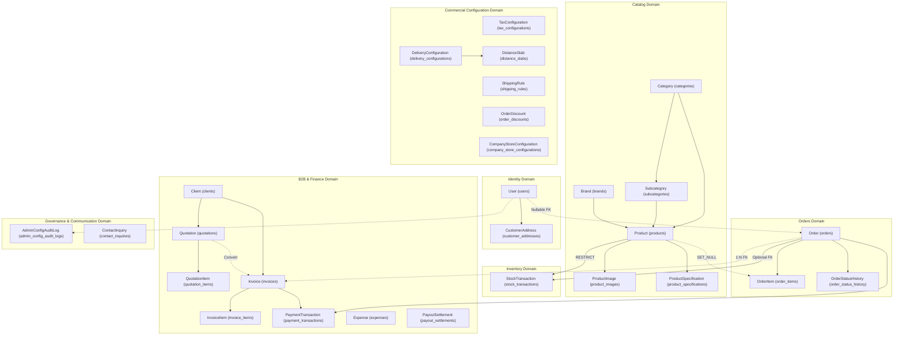

# Vee Electricals — Production Database Architecture & Technical Blueprint (Phase 2)

## 1. Executive Summary & Architectural Scope

This document defines the high-level production database architecture for the **Vee Electricals (Vee Power Electricals)** backend. The database supports a dual-audience commercial platform:
* **B2C Retail E-Commerce**: High-concurrency consumer catalog browsing, cart operations, distance-based delivery calculations, GST-compliant retail checkout, order fulfillment tracking, and customer address management.
* **B2B Corporate Contracting & Credit**: Contractor/client profiles with statutory GSTIN validation, commercial price quotations, quotation-to-invoice conversion, credit limit enforcement, and financial ledgering.

### 1.1 Architectural Target Stack
* **Client**: React 18, TypeScript, Tailwind CSS, Vite.
* **Backend Application Server**: Python 3.11+, Django 4.2+ LTS, Django REST Framework (DRF).
* **Database Engine**: MySQL 8.0+ / InnoDB Storage Engine.
* **Character Set & Collation**: `utf8mb4` / `utf8mb4_unicode_ci` (Full 4-byte Unicode for emoji support, Indian regional names, and address formatting).
* **Isolation Level**: `READ COMMITTED` (Standard for financial e-commerce; prevents dirty reads while maximizing transaction concurrency).
* **Deployment Target**: Docker Compose (`frontend`, `backend`, `db` using official MySQL 8.0 image, `nginx` reverse proxy).

---

## 2. Core Database Design Tenets

```
┌────────────────────────────────────────────────────────────────────────┐
│                     DATABASE DESIGN PRINCIPLES                         │
├────────────────────────────────────────────────────────────────────────┤
│ 1. Zero Monolithic Blobs: Strict relational normalization for entities │
│ 2. Strict Monetary Types: DECIMAL(12,2) / DECIMAL(14,2); never FLOAT  │
│ 3. Point-in-Time Freezing: Structured columns + immutable JSON snapshot │
│ 4. Audit & Ledger Protection: ON DELETE RESTRICT (models.PROTECT)       │
│ 5. Safe Multiplicity: 1:N capable schemas for staged B2B fulfillment   │
│ 6. Django-Native ORM Alignment: BigAutoField, CharField choices, etc.  │
└────────────────────────────────────────────────────────────────────────┘
```

1. **Strict Relational Normalization**: Primary transactional and catalog entities are normalized to Third Normal Form (3NF) to guarantee referential integrity and eliminate update anomalies.
2. **Intentional Denormalization for Historical Financial Snapshots**: In `orders`, `order_items`, `invoices`, and `invoice_items`, monetary amounts, tax rates, product names, SKUs, and applied delivery fees are copied as point-in-time values. Historical transactions must remain legally immutable regardless of catalog price changes or commercial configuration adjustments.
3. **Dual Financial Storage Strategy**:
   * **Structured Queryable Columns**: Essential financial figures (`subtotal`, `taxable_amount`, `tax_amount`, `cgst_amount`, `sgst_amount`, `igst_amount`, `shipping_fee`, `total_amount`) are stored in explicit, indexed `DECIMAL` columns. This enables fast SQL aggregations, date-range accounting reports, and tax audits.
   * **Immutable Calculation Snapshot JSON**: The complete computation context (active tax configuration version, distance slab parameters, formula breakdown, origin hub coordinates, applied discounts, and coupon details) is preserved in a `calculation_snapshot` JSON column. This allows full mathematical reconstruction of any order or invoice.
4. **Absolute Monetary Precision**: All monetary values are typed as `DECIMAL(12, 2)` (or `DECIMAL(14, 2)` for aggregate B2B values) and percentages as `DECIMAL(5, 2)`. IEEE 754 floating-point arithmetic (`FLOAT`/`DOUBLE`) is strictly prohibited.
5. **Ledger Immutability & Soft Deletion**: Audit ledgers (`stock_transactions`, `order_status_history`, `admin_config_audit_logs`) are **insert-only**. Updates and deletes are blocked. Foreign key deletion on historical links uses `ON DELETE RESTRICT` (`models.PROTECT`). Catalog products use soft deletion (`is_active = FALSE`).

---

## 3. High-Level Domain Architecture

The database architecture is partitioned into **seven cohesive functional domains**:



---

## 4. Master Entity Inventory & Domain Classification

The database comprises **28 normalized entities** across the seven domains:

| Entity # | Domain | Entity Name | Database Table Name | Purpose & Scope | Expected Volume | Criticality |
|---|---|---|---|---|---|---|
| **1** | Identity | `User` | `users` | Unified customer & administrator authentication and RBAC | Medium | Tier 1 (Critical) |
| **2** | Identity | `CustomerAddress` | `customer_addresses` | Saved customer shipping & billing address book | Medium | Tier 2 |
| **3** | Catalog | `Category` | `categories` | Product taxonomy parent & homepage hero promotion | Low (Static) | Tier 1 |
| **4** | Catalog | `Subcategory` | `subcategories` | Secondary classification under parent categories | Low (Static) | Tier 2 |
| **5** | Catalog | `Brand` | `brands` | Manufacturer brand directory (Havells, Polycab, etc.) | Low (Static) | Tier 1 |
| **6** | Catalog | `Product` | `products` | Master electrical merchandise catalog item | Medium | Tier 1 (Critical) |
| **7** | Catalog | `ProductImage` | `product_images` | Multi-image product gallery with sort order | High | Tier 2 |
| **8** | Catalog | `ProductSpecification`| `product_specifications` | Technical specifications (Wattage, Voltage, Sweep) | High | Tier 2 |
| **9** | Inventory | `StockTransaction` | `stock_transactions` | Immutable ledger of all warehouse movements | High | Tier 1 (Financial) |
| **10** | Orders | `Order` | `orders` | Customer purchases adhering to canonical 10-state FSM | High | Tier 1 (Critical) |
| **11** | Orders | `OrderItem` | `order_items` | Frozen line items snapshotting product price and name | Very High | Tier 1 (Financial) |
| **12** | Orders | `OrderStatusHistory` | `order_status_history` | Audit log of fulfillment transitions and tracking | High | Tier 2 |
| **13** | Configuration | `TaxConfiguration` | `tax_configurations` | Versioned statutory GST rates and calculation modes | Very Low | Tier 1 (Statutory) |
| **14** | Configuration | `DeliveryConfiguration` | `delivery_configurations` | Dispatch origin coordinates, base fee, slab step | Very Low | Tier 1 |
| **15** | Configuration | `DistanceSlab` | `distance_slabs` | Granular distance pricing increments | Low | Tier 1 |
| **16** | Configuration | `ShippingRule` | `shipping_rules` | Fallback regional state shipping rates | Low | Tier 2 |
| **17** | Configuration | `OrderDiscount` | `order_discounts` | Cart-level promotional coupon codes and caps | Low | Tier 2 |
| **18** | Configuration | `CompanyStoreConfiguration` | `company_store_configurations` | Consolidated company profile, bank info & store flags | Single-row | Tier 1 |
| **19** | B2B | `Client` | `clients` | Corporate clients, contractors, and credit limits | Low-Medium | Tier 1 |
| **20** | B2B | `Quotation` | `quotations` | Commercial project estimates and price proposals | Medium | Tier 2 |
| **21** | B2B | `QuotationItem` | `quotation_items` | Quoted line items inside a commercial quotation | Medium | Tier 2 |
| **22** | Finance | `Invoice` | `invoices` | Legal GST tax invoices (B2C & B2B) | High | Tier 1 (Statutory) |
| **23** | Finance | `InvoiceItem` | `invoice_items` | Frozen invoice line items with tax breakdown | Very High | Tier 1 (Statutory) |
| **24** | Finance | `PaymentTransaction` | `payment_transactions` | Inbound customer payment attempts & verification | High | Tier 1 (Financial) |
| **25** | Finance | `Expense` | `expenses` | Internal operational & capital expenses | Medium | Tier 2 |
| **26** | Finance | `PayoutSettlement` | `payout_settlements` | Gateway settlement batches deposited in merchant bank| Low-Medium | Tier 2 |
| **27** | Governance | `AdminConfigAuditLog` | `admin_config_audit_logs` | Append-only audit trail of commercial rule changes | Medium | Tier 1 (Audit) |
| **28** | Communication | `ContactInquiry` | `contact_inquiries` | Lead inquiries, bulk requests, and support tickets | Medium | Tier 3 |

---

## 5. Storage Engine & MySQL Server Configuration

### 5.1 Storage Engine Configuration
All tables MUST explicitly specify `ENGINE=InnoDB`. InnoDB provides:
* **ACID Transactions**: Required for atomic multi-table checkout operations (`Order` + `OrderItem` + `StockTransaction` + `PaymentTransaction`).
* **Row-Level Locking**: Minimizes lock contention during concurrent orders on identical products.
* **Foreign Key Referential Integrity**: Enforces `ON DELETE RESTRICT` and `ON DELETE SET NULL` constraints at the database engine level.
* **Crash Recovery**: Doublewrite buffer and write-ahead redo logging prevent data corruption on sudden container terminations.

### 5.2 Server Character Set & Collation
```sql
ALTER DATABASE vee_electricals CHARACTER SET = utf8mb4 COLLATE = utf8mb4_unicode_ci;
```
* **Character Set**: `utf8mb4` (guarantees safe storage of symbols, emoji, and multilingual Indian business data).
* **Collation**: `utf8mb4_unicode_ci` (accurate Unicode sorting and case-insensitive matching for emails, usernames, and search tokens).

### 5.3 SQL Modes
The database must operate with strict SQL mode enabled:
```sql
SET GLOBAL sql_mode = 'STRICT_TRANS_TABLES,ERROR_FOR_DIVISION_BY_ZERO,NO_ENGINE_SUBSTITUTION';
```
This guarantees that truncation of strings, invalid dates, or mathematical division errors fail immediately with an exception rather than silently inserting corrupted values.
