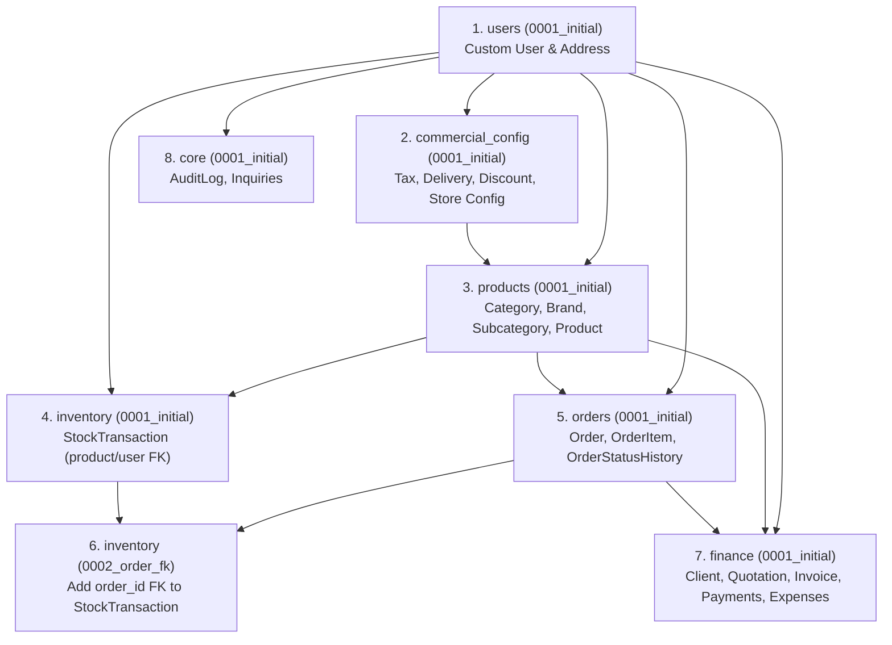

# Vee Electricals — Database Migration Plan & Dependency Graph (Phase 2)

## 1. Migration Architecture & Dependency Principles

Django migrations must execute in a strictly acyclic dependency graph. Attempting to create models that reference unmigrated foreign keys causes `CircularDependencyError` or unresolvable migration deadlocks.

> [!IMPORTANT]
> **No migrations will be generated or executed during Phase 2.** This document formalizes the planned migration dependency order for **Phase 3**.

---

## 2. Django App-by-App Migration Dependency Sequence



---

## 3. Detailed Step-by-Step Migration Execution Plan

### Step 1: Identity & Authentication Foundation (`users`)
* **Migration**: `users.0001_initial`
* **Dependencies**: None (Django core auth).
* **Entities Created**:
  * `User`: Custom user extending `AbstractUser` with `role`, `phone`, `email`.
  * `CustomerAddress`: Saved delivery addresses linked to `User`.
* **Rationale**: `User` is `settings.AUTH_USER_MODEL` and must be initialized before any other app creates foreign keys to administrators or customers.

### Step 2: Commercial Configuration (`commercial_config`)
* **Migration**: `commercial_config.0001_initial`
* **Dependencies**: `users.0001_initial` (for `created_by` foreign keys).
* **Entities Created**:
  * `TaxConfiguration`: Versioned GST tax rates and calculation modes.
  * `DeliveryConfiguration`: Warehouse origin coordinates and base charges.
  * `DistanceSlab`: Distance band intervals.
  * `ShippingRule`: Regional state fallback tariffs.
  * `OrderDiscount`: Promotional coupon codes.
  * `CompanyStoreConfiguration`: Master company profile and store operational flags.

### Step 3: Product Catalog Taxonomy & Merchandise (`products`)
* **Migration**: `products.0001_initial`
* **Dependencies**: `users.0001_initial`, `commercial_config.0001_initial`.
* **Entities Created**:
  * `Category`: Taxonomy parent and hero promotion metadata.
  * `Subcategory`: Child taxonomy under categories.
  * `Brand`: Manufacturer brand directory.
  * `Product`: Master catalog electrical goods merchandise with price/mrp check constraints.
  * `ProductImage`: Multi-image gallery.
  * `ProductSpecification`: Technical specifications.

### Step 4: Inventory Stock Ledger Base (`inventory`)
* **Migration**: `inventory.0001_initial`
* **Dependencies**: `products.0001_initial`, `users.0001_initial`.
* **Entities Created**:
  * `StockTransaction`: Immutable warehouse movement ledger with `product_id` (`ON DELETE RESTRICT`) and `performed_by_id`. (Field `order_id` is left deferred to Step 6 to eliminate circular dependency between `orders` and `inventory`).

### Step 5: Orders & Fulfillment Tracking (`orders`)
* **Migration**: `orders.0001_initial`
* **Dependencies**: `users.0001_initial`, `products.0001_initial`.
* **Entities Created**:
  * `Order`: Customer orders adhering to 10-state FSM, snapshot fields, and non-negative total constraints.
  * `OrderItem`: Line items with frozen name, SKU, price, and tax values (`product_id` `ON DELETE SET NULL`).
  * `OrderStatusHistory`: Chronological audit log of fulfillment updates.

### Step 6: Inventory-Order Cross Link (`inventory`)
* **Migration**: `inventory.0002_order_fk`
* **Dependencies**: `inventory.0001_initial`, `orders.0001_initial`.
* **Modifications**:
  * Alters `StockTransaction` to add optional foreign key `order_id -> orders(id) ON DELETE SET NULL`.
* **Rationale**: Eliminates circular foreign key dependency between `orders` and `inventory`.

### Step 7: B2B, Tax Invoicing, Payments & Expenses (`finance`)
* **Migration**: `finance.0001_initial`
* **Dependencies**: `users.0001_initial`, `products.0001_initial`, `orders.0001_initial`.
* **Entities Created**:
  * `Client`: B2B corporate buyers and contractor credit limits.
  * `Quotation`: Commercial project estimates (FK to `Client` and `User`).
  * `QuotationItem`: Quoted line items (`FK -> Quotation CASCADE`, `FK -> Product SET_NULL`).
  * `Invoice`: Legal GST tax invoices with 1:N foreign key to `orders(id)`, `clients(id)`, and unidirectional link to `quotations(id)` (`ON DELETE SET NULL`).
  * `InvoiceItem`: Invoiced line items with detailed GST breakdown (`FK -> Invoice CASCADE`).
  * `PaymentTransaction`: Customer inbound payments against orders and invoices.
  * `Expense`: Internal administrative operating expenses.
  * `PayoutSettlement`: Gateway settlement batches deposited into merchant bank.
* **Acyclic Guarantee**: `Quotation` has no foreign key to `Invoice`. The relationship is strictly unidirectional (`Invoice.quotation_id -> quotations(id)`), eliminating circular foreign keys and avoiding any need for deferred invoice migrations.

### Step 8: Governance & Customer Communications (`core`)
* **Migration**: `core.0001_initial`
* **Dependencies**: `users.0001_initial`.
* **Entities Created**:
  * `AdminConfigAuditLog`: Append-only audit trail recording rule modifications.
  * `ContactInquiry`: Customer inquiries and lead tickets.

---

## 4. Rollback & Disaster Recovery Strategy

* **Reversibility**: Every migration in the graph must implement a fully symmetric `down` migration (`operations.RunPython` or standard Django reverse operations).
* **Pre-Migration Backup**: In production deployments, MySQL backups are generated prior to running `python manage.py migrate`:
  ```bash
  mysqldump -u vee_user -p vee_electricals --single-transaction --routines --triggers > backup_pre_migration.sql
  ```
* **Zero Zero-Downtime Violations**: Column additions to high-volume tables (`orders`, `order_items`, `products`) must specify defaults or `null=True` to prevent long metadata locks on production MySQL tables.
