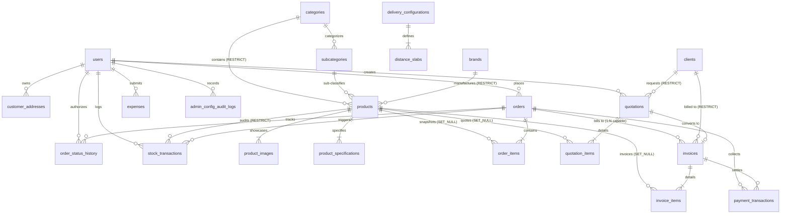

# Vee Electricals — Database Relationships & Referential Integrity Blueprint (Phase 2)

## 1. Overview of Entity Relationships

This document specifies the referential integrity rules, foreign key constraints, relationship cardinalities, and deletion behaviors governing all 28 entities of the **Vee Power Electricals** database.

### 1.1 Referential Integrity Tenets
1. **Zero Undocumented `CASCADE` Deletions**: `CASCADE` deletion is strictly restricted to owned child components that possess no independent commercial or accounting value (e.g. `product_images`, `product_specifications`, `order_status_history`, `distance_slabs`).
2. **Absolute Protection of Historical Ledgers (`models.PROTECT`)**: Financial transactions, stock ledgers, and tax invoices must never be deleted by cascade from parent merchandise or client records. Any attempt to hard-delete a parent entity with active ledger history must be rejected by the MySQL engine (`ON DELETE RESTRICT`).
3. **Point-in-Time Decoupling (`ON DELETE SET NULL`)**: Historical line items (`order_items`, `invoice_items`, `quotation_items`) preserve complete snapshots of names, SKUs, and prices. If a catalog product is archived or permanently purged, the foreign key safely defaults to `NULL`, leaving past accounting records 100% intact.

---

## 2. Master Foreign Key & Deletion Matrix

| Parent Table | Child Table | Foreign Key Column | Cardinality | Deletion Behavior (`on_delete`) | Nullable / Optional | Business Rationale & Historical Risk Analysis |
|---|---|---|---|---|---|---|
| `users` | `customer_addresses` | `user_id` | 1 to Many | `CASCADE` | Mandatory | Address book entries belong exclusively to the customer account. Deleting user cleans up address entries. |
| `users` | `orders` | `user_id` | 1 to Many | `SET_NULL` | Optional | Orders must survive customer account deletion to preserve corporate accounting history. Supports guest checkout (`user_id = NULL`). |
| `users` | `order_status_history`| `changed_by_id` | 1 to Many | `SET_NULL` | Optional | Order fulfillment history survives even if staff employee account is deactivated or deleted. |
| `users` | `stock_transactions` | `performed_by_id`| 1 to Many | `SET_NULL` | Optional | Warehouse inventory movements remain preserved even if warehouse staff account is deleted. |
| `users` | `quotations` | `created_by_id` | 1 to Many | `SET_NULL` | Optional | Commercial quotes preserve pricing even if sales engineer account is deleted. |
| `users` | `expenses` | `created_by_id` | 1 to Many | `SET_NULL` | Optional | Operational expense entries must survive authorizer account deletion. |
| `users` | `tax_configurations` | `created_by_id` | 1 to Many | `SET_NULL` | Optional | Historical tax versions preserve authorizer ID without cascade risk. |
| `users` | `delivery_configurations`| `created_by_id` | 1 to Many | `SET_NULL` | Optional | Delivery tariffs preserve authorizer ID. |
| `users` | `order_discounts` | `created_by_id` | 1 to Many | `SET_NULL` | Optional | Coupon promo codes preserve creator ID. |
| `users` | `admin_config_audit_logs`| `admin_user_id` | 1 to Many | `SET_NULL` | Optional | Audit trail logs must survive staff account deletion for legal auditability. |
| `categories` | `subcategories` | `category_id` | 1 to Many | `CASCADE` | Mandatory | Subcategories cannot exist without their parent category. |
| `categories` | `products` | `category_id` | 1 to Many | `RESTRICT` | Mandatory | Database engine prevents deleting a category if active products belong to it. Prevents orphaned merchandise. |
| `subcategories`| `products` | `subcategory_id` | 1 to Many | `SET_NULL` | Optional | Products can belong directly to category without requiring a subcategory. |
| `brands` | `products` | `brand_id` | 1 to Many | `RESTRICT` | Mandatory | Database engine prevents deleting a manufacturer brand if products are associated with it. |
| `products` | `product_images` | `product_id` | 1 to Many | `CASCADE` | Mandatory | Gallery images belong strictly to parent product. |
| `products` | `product_specifications`| `product_id` | 1 to Many | `CASCADE` | Mandatory | Technical specs are deleted if parent product is deleted. |
| `products` | `stock_transactions` | `product_id` | 1 to Many | `RESTRICT` | Mandatory | **CRITICAL INTEGRITY**: Stock ledger is immutable. Database engine blocks physical deletion of any product with inventory history. Catalog uses soft deletion (`active = FALSE`). |
| `products` | `order_items` | `product_id` | 1 to Many | `SET_NULL` | Optional | Historical order items snapshot name/price; foreign key safely becomes NULL if product is removed. |
| `products` | `quotation_items` | `product_id` | 1 to Many | `SET_NULL` | Optional | Commercial quotes preserve quoted descriptions even if product is deleted. |
| `products` | `invoice_items` | `product_id` | 1 to Many | `SET_NULL` | Optional | Tax invoices preserve statutory tax line items even if catalog product is deleted. |
| `orders` | `order_items` | `order_id` | 1 to Many | `CASCADE` | Mandatory | Order line items exist strictly within the parent order. |
| `orders` | `order_status_history`| `order_id` | 1 to Many | `CASCADE` | Mandatory | Status transition audit logs belong strictly to parent order. |
| `orders` | `invoices` | `order_id` | 1 to Many (1:1 B2C)| `SET_NULL` | Optional | Retail invoice generated from an order. Modeled as 1:N at DB level for B2B staged billing, with 1:1 retail app constraint. |
| `orders` | `stock_transactions` | `order_id` | 1 to Many | `SET_NULL` | Optional | Links stock deductions and return restocks to specific customer orders. |
| `orders` | `payment_transactions`| `order_id` | 1 to Many | `SET_NULL` | Optional | Tracks customer payment attempts against order. |
| `clients` | `quotations` | `client_id` | 1 to Many | `RESTRICT` | Mandatory | Cannot delete corporate client with active quotation records. |
| `clients` | `invoices` | `client_id` | 1 to Many | `RESTRICT` | Optional | Cannot delete corporate client with active tax invoices. |
| `quotations` | `quotation_items` | `quotation_id` | 1 to Many | `CASCADE` | Mandatory | Quotation items belong strictly to parent quotation. |
| `quotations` | `invoices` | `quotation_id` | 1 to 1 | `SET_NULL` | Optional | Converted quotation links to resulting invoice. |
| `invoices` | `invoice_items` | `invoice_id` | 1 to Many | `CASCADE` | Mandatory | Invoiced tax line items belong strictly to parent tax invoice. |
| `invoices` | `payment_transactions`| `invoice_id` | 1 to Many | `SET_NULL` | Optional | Tracks payment attempts against B2B/B2C invoice. |
| `delivery_configurations` | `distance_slabs` | `delivery_config_id` | 1 to Many | `CASCADE` | Mandatory | Distance slab intervals belong strictly to parent delivery configuration. |

---

## 3. Complete Entity Relationship Diagram (ERD)

---

## 4. In-Depth Multiplicity & Cardinality Analysis

### 4.1 Order $\rightarrow$ Invoice Cardinality (1:1 vs 1:N)
* **Standard E-Commerce (B2C)**: 1 Order $\rightarrow$ 1 Invoice. When a retail customer pays at checkout, exactly one tax invoice (`INV-2026-XXXX`) is issued.
* **Contractor Projects (B2B)**: 1 Order $\rightarrow$ Many Invoices. Corporate contractors (e.g. L&T Construction) place bulk orders that are dispatched in multiple partial shipments over several weeks. Each shipment requires its own statutory GST tax invoice.
* **Database Representation**: `invoices.order_id` is an optional foreign key (`BIGINT UNSIGNED NULL`) without a table-level unique constraint. In Django application logic, B2C checkout enforces a 1:1 relationship, while B2B fulfillment views allow multiple invoices against the same `order_id`.

### 4.2 Quotation $\rightarrow$ Invoice Cardinality (1:1)
* A commercial quotation represents a single commercial negotiation.
* **Authoritative Relational Direction**: `invoices.quotation_id` $\rightarrow$ `quotations(id)` (`ON DELETE SET NULL`).
* The `quotations` table contains **no** `converted_invoice_id` column, eliminating circular foreign key dependencies and preventing migration graph deadlocks.
* Conversion is strictly one-way and tracked by `quotations.status = 'Converted'`. The resulting `Invoice` references the originating `Quotation` via `invoices.quotation_id`. Reverse traversal in Django is accessed cleanly via `quotation.invoices.first()`.

### 4.3 Product $\rightarrow$ StockTransaction Protection (`RESTRICT`)
* Phase 1 documentation incorrectly listed `CASCADE` deletion on `stock_transactions.product_id`.
* Under Indian Commercial Law and statutory tax auditing rules, physical inventory movement records must be retained for at least 8 financial years.
* **Target Schema**: Enforces `ON DELETE RESTRICT` (Django `models.PROTECT`). Attempting to run `DELETE FROM products WHERE id = 1` when stock movements exist will trigger MySQL error `1451: Cannot delete or update a parent row: a foreign key constraint fails`.
* Deactivation is handled via soft deletion (`active = FALSE`).
