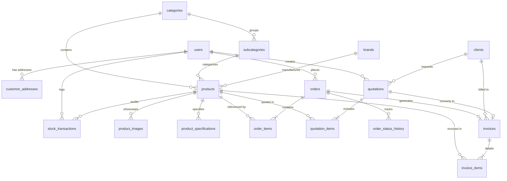

# Vee Electricals — Entity Relationship Map & Database Integrity (Phase 1)

## 1. Overview of Entity Relationships

The Vee Electricals relational database model connects retail customer workflows, product catalog taxonomy, inventory auditing, order fulfillment, B2B corporate credit, and tax invoicing.

The model is normalized to 3rd Normal Form (3NF) to eliminate data redundancy, prevent update anomalies, and enforce strict referential integrity.

---

## 2. Complete Relationship Specifications

### Comprehensive Foreign Key Table

| Parent Entity | Child Entity | Foreign Key Column | Cardinality | Delete Behavior | Mandatory / Optional | Business Rationale |
|---|---|---|---|---|---|---|
| `users` | `customer_addresses` | `user_id` | 1 to Many | `CASCADE` | Mandatory | Address book belongs to user; deleting user removes addresses. |
| `users` | `orders` | `user_id` | 1 to Many | `SET_NULL` | Optional | Orders remain historically preserved even if user account is deleted. |
| `users` | `order_status_history` | `changed_by_id` | 1 to Many | `SET_NULL` | Optional | Tracks which staff member updated the order. |
| `users` | `stock_transactions` | `performed_by_id`| 1 to Many | `SET_NULL` | Optional | Audits warehouse staff member who modified stock. |
| `users` | `quotations` | `created_by_id` | 1 to Many | `SET_NULL` | Optional | Tracks sales engineer who created quote. |
| `categories` | `subcategories` | `category_id` | 1 to Many | `CASCADE` | Mandatory | Subcategories cannot exist without a parent category. |
| `categories` | `products` | `category_id` | 1 to Many | `RESTRICT` | Mandatory | Prevent deleting category if active products still belong to it. |
| `subcategories`| `products` | `subcategory_id` | 1 to Many | `SET_NULL` | Optional | Products can belong directly to category without subcategory. |
| `brands` | `products` | `brand_id` | 1 to Many | `RESTRICT` | Mandatory | Prevent deleting brand if products are associated with it. |
| `products` | `product_images` | `product_id` | 1 to Many | `CASCADE` | Mandatory | Product gallery images belong strictly to that product. |
| `products` | `product_specifications`| `product_id` | 1 to Many | `CASCADE` | Mandatory | Technical specs are deleted if product is deleted. |
| `products` | `stock_transactions` | `product_id` | 1 to Many | `CASCADE` | Mandatory | Stock history is tied to product. |
| `products` | `order_items` | `product_id` | 1 to Many | `SET_NULL` | Optional | Order items snapshot product name/price; FK becomes null on delete. |
| `products` | `quotation_items` | `product_id` | 1 to Many | `SET_NULL` | Optional | Quotations preserve quoted descriptions even if product is deleted. |
| `products` | `invoice_items` | `product_id` | 1 to Many | `SET_NULL` | Optional | Invoices preserve tax line items even if product is deleted. |
| `orders` | `order_items` | `order_id` | 1 to Many | `CASCADE` | Mandatory | Order items exist strictly within an order. |
| `orders` | `order_status_history`| `order_id` | 1 to Many | `CASCADE` | Mandatory | Audit history belongs to the order. |
| `orders` | `invoices` | `order_id` | 1 to 1 / Many | `SET_NULL` | Optional | Retail invoice generated from an order. |
| `orders` | `stock_transactions` | `order_id` | 1 to Many | `SET_NULL` | Optional | Links stock deductions/returns to specific orders. |
| `clients` | `quotations` | `client_id` | 1 to Many | `RESTRICT` | Mandatory | Cannot delete corporate client with active quotation records. |
| `clients` | `invoices` | `client_id` | 1 to Many | `RESTRICT` | Optional | Invoices issued directly to B2B corporate client. |
| `quotations` | `quotation_items` | `quotation_id` | 1 to Many | `CASCADE` | Mandatory | Quotation items belong strictly to the parent quotation. |
| `quotations` | `invoices` | `quotation_id` | 1 to 1 | `SET_NULL` | Optional | Converted quotation links to resulting invoice. |
| `invoices` | `invoice_items` | `invoice_id` | 1 to Many | `CASCADE` | Mandatory | Invoice items belong strictly to parent invoice. |

---

## 3. Relationship Architecture Diagram

---

## 4. Key Architectural & Integrity Decisions

### 1. Zero Historical Data Loss (Point-in-Time Snapshots)
* In `order_items`, `quotation_items`, and `invoice_items`, the item names, rates, and prices are **copied directly into the record** at creation time.
* If a product's price or name changes in the catalog later, historical orders and invoices remain legally unaltered.
* If a product is permanently deleted from the store, `product_id` is set to `NULL` via `ON DELETE SET NULL`, leaving past accounting records completely intact.

### 2. Elimination of Circular Dependencies
* `orders` and `invoices`: An order can optionally reference or be referenced by an invoice via `invoices.order_id`. There is no reciprocal foreign key on `orders` pointing back to `invoices`.
* `quotations` and `invoices`: `invoices.quotation_id` stores the parent quote reference when converted. There is no reciprocal foreign key on `quotations`.

### 3. Inventory Stock Synchronization
* All product stock changes are logged in `stock_transactions`.
* Deductions occur when an order transitions to `CONFIRMED` or `PACKED`.
* Restocks occur on order `CANCELLED` or `RETURN_COMPLETED`.
* This ensures physical inventory matches accounting balances at all times.
