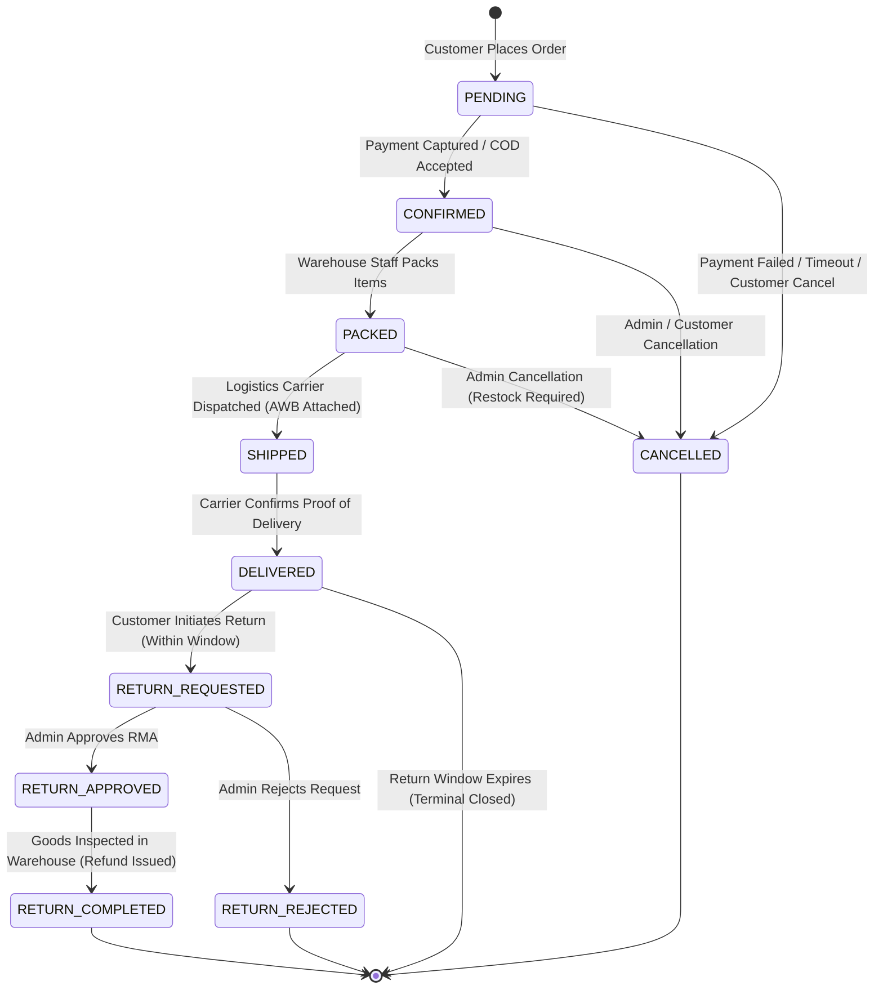

# Vee Electricals — Canonical Order State Machine & Fulfillment Lifecycle (Phase 1.5)

## 1. Discrepancy Analysis Across Existing Codebase

During the Phase 1 inspection of the frontend codebase, four conflicting definitions of the order status lifecycle were discovered across TypeScript interfaces and UI components.

### 1.1 Discrepancy Evidence
1. **`frontend/src/types/order.ts` (Line 25)**:
   ```typescript
   status: 'Pending' | 'Processing' | 'Shipped' | 'Delivered' | 'Cancelled';
   ```
2. **`frontend/src/context/ShopContext.tsx`**:
   ```typescript
   status: 'pending' | 'processing' | 'shipped' | 'delivered';
   ```
3. **`frontend/src/pages/admin/Orders.tsx` (Line 49)**:
   ```typescript
   const STATUS_TABS = ["All", "Confirmed", "Packed", "Shipped", "Delivered", "Return Approved", "Return Completed", "Cancelled"];
   ```
4. **`frontend/src/pages/customer/Account.tsx`**:
   Handles an ad-hoc mix: `Delivered`, `Shipped`, `Processing`, `Pending`, `Confirmed`, `Packed`, `Cancelled`.

### 1.2 The Conflict
* `Processing` in consumer views conflates two distinct physical warehouse stages: order confirmation (`Confirmed`) and warehouse item packaging (`Packed`).
* `Account.tsx` displays statuses that `order.ts` does not declare.
* `Orders.tsx` introduces post-delivery RMA return states (`Return Approved`, `Return Completed`) that have no corresponding state in `order.ts`.

---

## 2. Canonical Order State Model

To eliminate state confusion and enforce warehouse and accounting integrity, the system adopts a unified **10-state finite state machine (FSM)**.

```
┌──────────────────────────────────────────────────────────────────────────────────┐
│                           CANONICAL ORDER STATES                                 │
├────────────────────┬─────────────────────────────────────────────────────────────┤
│ 1. PENDING         │ Order created at checkout; awaiting online payment / check  │
│ 2. CONFIRMED       │ Payment verified or COD confirmed; queued for fulfillment   │
│ 3. PACKED          │ Items picked & packaged; carton labeled; ready for courier  │
│ 4. SHIPPED         │ Dispatched with logistics carrier; AWB tracking attached    │
│ 5. DELIVERED       │ Courier confirmed delivery to recipient address             │
│ 6. CANCELLED       │ Terminal aborted state prior to dispatch                    │
│ 7. RETURN_REQUESTED│ Post-delivery return initiated by customer                  │
│ 8. RETURN_APPROVED │ Store admin approved return; awaiting reverse pickup        │
│ 9. RETURN_REJECTED │ Store admin rejected return (e.g. damaged seal/expired)     │
│ 10. RETURN_COMPLETED│ Returned stock received & inspected; refund executed       │
└────────────────────┴─────────────────────────────────────────────────────────────┘
```

---

## 3. Order Lifecycle State Diagram



---

## 4. State Transition & Business Effect Matrix

| Current State | Event / Trigger | Target State | Authorized Actor | Physical Inventory Effect | Financial & Payment Effect | Validation & Audit Requirement |
|---|---|---|---|---|---|---|
| `[*] (None)` | `CHECKOUT_SUBMIT` | `PENDING` | Customer / Guest | Stock reserved (or untouched until confirmed) | Payment intent created | Valid cart, address, and positive total. |
| `PENDING` | `PAYMENT_CAPTURED` | `CONFIRMED` | Gateway / System | **Physical Stock Decremented** (`SALE` transaction logged) | `payment_status = 'Paid'` | Generates official `Invoice`. |
| `PENDING` | `COD_CONFIRMED` | `CONFIRMED` | Admin / System | **Physical Stock Decremented** (`SALE` transaction logged) | `payment_status = 'Pending'` | Validates COD limit. |
| `PENDING` | `PAYMENT_TIMEOUT` | `CANCELLED` | Automated Cron | No inventory impact | Payment abandoned | Logged after timeout (e.g., 30 mins). |
| `PENDING` | `CUSTOMER_CANCEL` | `CANCELLED` | Customer | No inventory impact | Void payment authorization | Customer can cancel immediately. |
| `CONFIRMED` | `WAREHOUSE_PACK` | `PACKED` | Admin / Warehouse | None (already decremented) | None | Order packed; parcel dimensions logged. |
| `CONFIRMED` | `ADMIN_CANCEL` | `CANCELLED` | Admin | **Stock Restored** (`RETURN`/`ADJUSTMENT` logged) | Full refund triggered | Admin must provide reason note. |
| `CONFIRMED` | `CUSTOMER_CANCEL` | `CANCELLED` | Customer | **Stock Restored** (`RETURN` logged) | Refund initiated | Allowed if configured in `OrderConfig`. |
| `PACKED` | `DISPATCH_CARRIER` | `SHIPPED` | Admin / Logistics | None | None | **Mandatory tracking number (AWB)** required. |
| `PACKED` | `ADMIN_CANCEL` | `CANCELLED` | Admin | **Stock Restored** (Unpacked & Restocked) | Refund initiated | Packaging discarded; restock logged. |
| `SHIPPED` | `CARRIER_DELIVER` | `DELIVERED` | Logistics / Admin | None (transfer complete) | None (or COD marked `Paid`) | Delivery timestamp recorded. |
| `DELIVERED` | `REQUEST_RETURN` | `RETURN_REQUESTED`| Customer | None | None | Must be within `return_window_days`. |
| `RETURN_REQUESTED`| `APPROVE_RETURN` | `RETURN_APPROVED` | Admin | None | Reverse logistics AWB generated | Return reason vetted by admin. |
| `RETURN_REQUESTED`| `REJECT_RETURN` | `RETURN_REJECTED` | Admin | None | None | Rejection reason communicated to buyer. |
| `RETURN_APPROVED` | `INSPECT_RESTOCK` | `RETURN_COMPLETED`| Warehouse Admin | **Stock Restored** (`RETURN` transaction logged) | Refund issued / Credit note created | Physical inspection verification signed. |

---

## 5. Prohibited & Invalid Transitions

The state machine strictly prevents illegal transitions that could corrupt stock ledgers or accounting balances:

1. **`SHIPPED` $\rightarrow$ `CANCELLED` [FORBIDDEN]**: Once goods are in transit with a third-party courier, an order cannot be simply cancelled. It must follow the delivery and return/RTO (Return to Origin) protocol.
2. **`DELIVERED` $\rightarrow$ `CANCELLED` [FORBIDDEN]**: Delivered goods cannot be cancelled; they must enter the `RETURN_REQUESTED` workflow.
3. **`CANCELLED` $\rightarrow$ `CONFIRMED` / Any State [FORBIDDEN]**: Cancellation is an immutable terminal state. If a customer wishes to repurchase, a new order must be generated.
4. **`RETURN_COMPLETED` $\rightarrow$ Any State [FORBIDDEN]**: Terminal refund/restock state.
5. **`PENDING` $\rightarrow$ `SHIPPED` [FORBIDDEN]**: Cannot skip confirmation and packing stages.

---

## 6. Frontend Mapping & Backward Compatibility Strategy

To ensure zero disruption to existing frontend screens during Phase 4 integration, the canonical backend states map seamlessly to existing UI components:

| Canonical Backend State | Legacy Customer View (`Account.tsx`) | Legacy Admin Filter (`Orders.tsx`) | Badge Styling in Frontend |
|---|---|---|---|
| `PENDING` | `Pending` | (Optional filter / All) | `bg-slate-100 text-slate-700` |
| `CONFIRMED` | `Confirmed` (or `Processing`) | `Confirmed` | `bg-blue-100 text-blue-700` |
| `PACKED` | `Packed` (or `Processing`) | `Packed` | `bg-amber-100 text-amber-700` |
| `SHIPPED` | `Shipped` | `Shipped` | `bg-indigo-100 text-indigo-700` |
| `DELIVERED` | `Delivered` | `Delivered` | `bg-emerald-100 text-emerald-700` |
| `CANCELLED` | `Cancelled` | `Cancelled` | `bg-red-100 text-red-700` |
| `RETURN_REQUESTED` | `Return Requested` | `Return Approved` (Pending tab) | `bg-orange-100 text-orange-700` |
| `RETURN_APPROVED` | `Return Approved` | `Return Approved` | `bg-orange-100 text-orange-700` |
| `RETURN_REJECTED` | `Return Rejected` | `Cancelled` | `bg-slate-100 text-slate-700` |
| `RETURN_COMPLETED` | `Return Completed` | `Return Completed` | `bg-slate-100 text-slate-700` |

---

## 7. Open Business Decisions & Configuration Hooks

1. **Auto-Cancellation Window for Unpaid Orders (`auto_cancel_unpaid_minutes`)**:
   * *Status*: Configurable in `OrderConfiguration`. Recommended default: `30 minutes`.
2. **Customer Self-Service Cancellation Cut-off**:
   * *Status*: Configurable. Recommended default: Customer may self-cancel while in `PENDING` and `CONFIRMED`; once status changes to `PACKED`, cancellation requires calling customer support.
3. **Return Eligibility Window (`return_window_days`)**:
   * *Status*: Configurable in `OrderConfiguration`. Recommended default: `7 days` post-delivery for electrical items (provided original packaging is intact).
