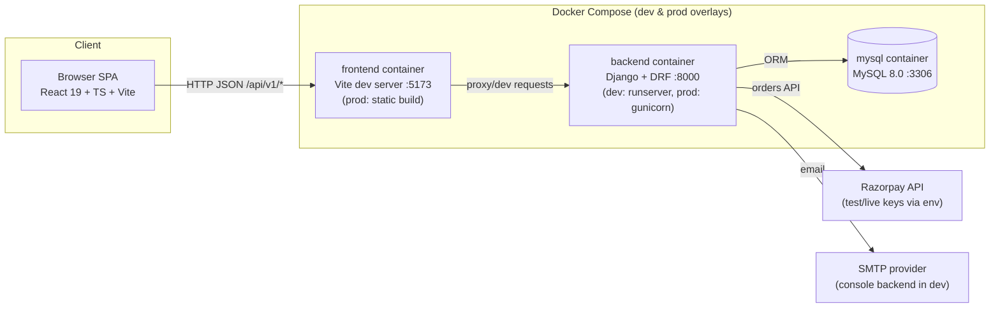

# Vee Power Electricals — Architecture

Describes the **actual current implementation** (verified at commit `d0a62a3`).
Sources of truth: code, models/migrations, tests, API routes, configuration —
in that order.

## 1. System Overview

## 2. Layered Boundaries

| Layer | Where | Responsibility | Rule |
|---|---|---|---|
| Presentation | `frontend/src` | UI, client cart, auth state, route guards | Never contains business pricing/tax logic |
| API | `backend/apps/*/views.py`, `serializers.py` | HTTP contract: auth, validation, serialization, permissions | Thin; delegates to services |
| Business logic | `backend/apps/*/services.py` | Pricing, tax, stock, FSM, credit, invoicing, payments | Only place allowed to mutate business state; transaction/lock ownership |
| Persistence | `backend/apps/*/models.py`, migrations, MySQL | Schema, constraints, indexes | DB CHECK/UNIQUE constraints back critical invariants |

## 3. Frontend

- **React 19 + TypeScript + Vite 8 + Tailwind CSS 4** (`frontend/src`).
- **Routing:** `react-router-dom` v7 (`src/App.tsx`), all pages `React.lazy` +
  `<Suspense>`; every route chunk is code-split (Step 17).
- **Layouts:** `CustomerLayout` (public store), `AdminLayout` (lazy-loaded admin
  shell, never requested on customer routes).
- **Route protection:** `ProtectedRoute allowedRoles={[...]}` wraps
  `/checkout`, `/account/*`, and the whole `/admin` tree (admin-only).
- **State:** `AuthContext` (JWT + role), `CartContext` (client-side cart until
  checkout), `ShopContext` (catalog/brand state for admin routes).
- **API layer:** `src/api/` — one typed module per domain (`auth`, `catalog`,
  `orders`, `payments`, `finance`, `config`, `inventory`, `addresses`,
  `inquiries`) over `client.ts` (axios instance, base URL from
  `VITE_API_URL`, canonical `CanonicalApiError` error envelope,
  JWT attach + refresh-on-401 handling in `services/api.ts`).
- **Error handling:** global `ErrorBoundary`, canonical error surface from the
  API client, per-page error states. See `docs/error-handling/README.md`.
- **Legacy services** (`src/services/*`) remain for a few flows; `src/api/` is
  the canonical client layer.

## 4. Backend

- **Django 5 + Django REST Framework** (`backend/`), project config in
  `backend/config/settings/{base,development,production}.py`.
- **Apps** (`backend/apps/`): `users` (auth + addresses), `products` (catalog:
  categories, subcategories, brands, products, images, specs), `inventory`
  (stock + ledger), `orders` (orders, checkout, FSM, returns), `finance`
  (clients, quotations, invoices, payments, settlements, expenses), 
  `commercial_config` (store/tax/delivery/slabs/shipping-rules/discounts/
  coupons + audit log), `core` (inquiries, communication, config audit),
  `common` (shared abstractions).
- **Pattern per app:** `models.py` → `serializers.py` → `services.py` →
  `views.py` (+ `urls.py`). Views authenticate (`IsAuthenticated`,
  role-based permission classes), validate via serializers, then call services.
- **Auth:** JWT access/refresh (`rest_framework_simplejwt`); password reset via
  emailed token hooks; roles `customer` / `admin` (see
  `docs/security/authentication.md`).
- **Exception handling:** canonical error envelope with `code`, `message`,
  `details`, `request_id` (Step 12 hardening) — see
  `docs/error-handling/README.md`.

## 5. Database

- **MySQL 8.0** in Docker (dev falls back to SQLite via `USE_SQLITE=True`).
- 30+ models across 8 apps; **41 tables** physical snapshot audited in Step 18
  (`docs/database/README.md`).
- **Integrity constraints:** DB-level `CheckConstraint`s (e.g.
  `chk_pay_reference` — a payment must reference an order or invoice) and
  `UniqueConstraint`s (SKU, gateway transaction id, GSTIN, order/invoice
  numbers) back application rules; verified by the 44-check live audit.
- **Transactions & locking:** checkout, payment capture, quotation conversion,
  credit checks and stock movements run inside
  `transaction.atomic()` with `select_for_update()` row locks
  (overselling and double-conversion protection). See
  `docs/workflows/README.md`.
- **Migrations:** single linear migration history per app (39 nodes, all
  applied); models and migrations verified synchronized at `d0a62a3`.

## 6. Infrastructure

- `docker-compose.yml` (dev, live-reload): `mysql` (healthcheck),
  `backend` (`runserver`, mounts source, healthcheck on `/api/v1/health/`),
  `frontend` (Vite dev server `--host 0.0.0.0`).
- `docker-compose.prod.yml` (overlay): backend runs
  `gunicorn --workers 3 config.wsgi:application`; frontend served as a static
  production build.
- Env via `.env` files documented with placeholders in
  `docs/deployment/environment-configuration.md` — never commit real values.

## 7. Key Architectural Decisions

1. **Pricing/tax authority is backend-only.** The client cart is indicative;
   `BillingService` computes discounts, taxable values and GST (CGST/SGST
   intra-state vs IGST inter-state) at checkout, and the order stores a
   calculation snapshot. Composition: `total = subtotal(net) + tax + shipping`.
2. **Order tax is order-level**; order items carry `tax_amount = 0.00`
   deliberately (populated only in the order aggregate).
3. **Idempotency at the service layer.** Payment verification and
   `record_payment` replay outcomes by `gateway_transaction_id`; the DB index
   is intentionally non-unique to make duplicate attempts idempotent, not fatal.
4. **One quotation → at most one (non-cancelled) invoice**, enforced in
   `QuotationService` (status check + invoice-existence guard, Step 18).
5. **Append-only ledgers.** Stock transactions and audit logs are never edited;
   corrections are new compensating rows.
6. **Client-side cart until checkout** — cart is not persisted server-side.
