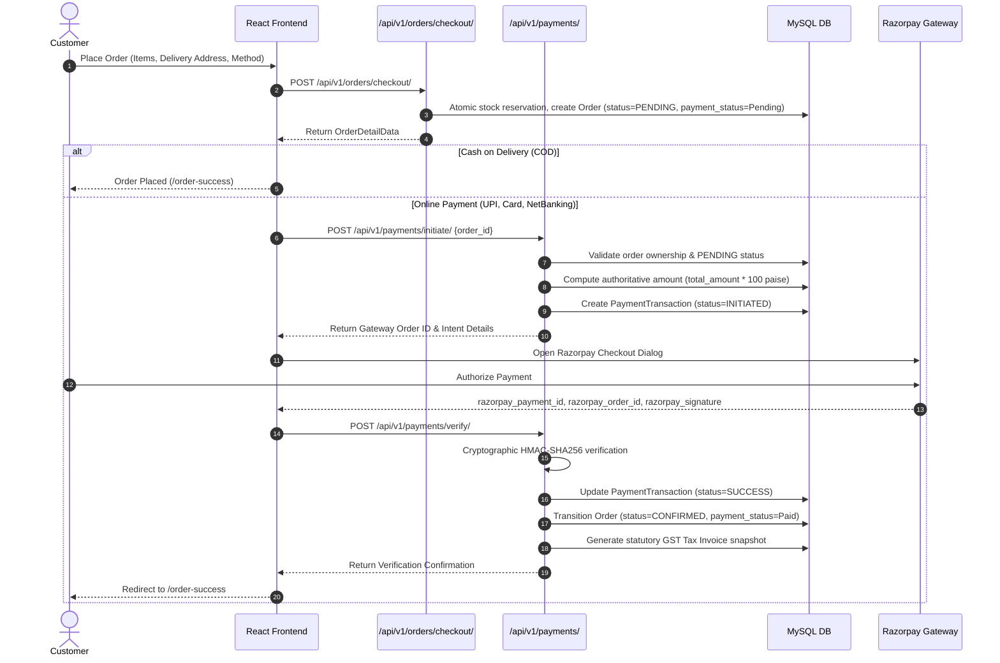
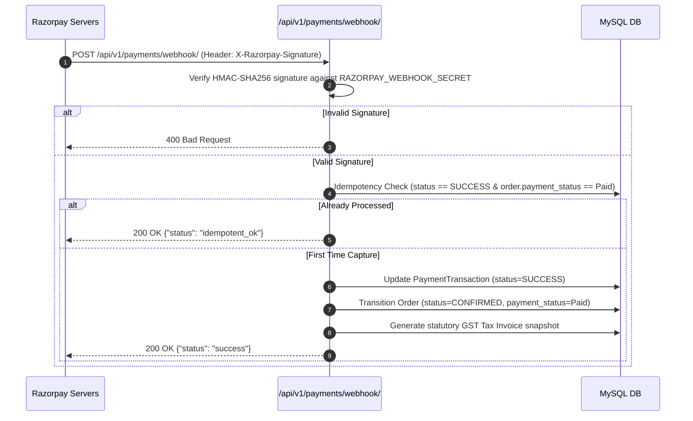

# Vee Power Electricals — Payment Gateway Integration Architecture (Razorpay)

## 1. Overview & Provider Decision

- **Provider**: **Razorpay** (Canonical Indian payment rail for Cards, UPI / QR, Net Banking, and B2B corporate purchasing).
- **Environment**: Multi-environment with sandbox/test mock fallback (`rzp_test_*`) and live production routing (`rzp_live_*`).
- **Core Security Principle**: Server-authoritative billing, cryptographic HMAC-SHA256 signature verification, strict data isolation, zero plaintext credential leakage.

---

## 2. Payment Flow Architecture



---

## 3. Asynchronous Webhook Architecture



---

## 4. Cryptographic Signature Verification

All client responses and asynchronous webhooks undergo server-side HMAC-SHA256 validation:

```python
# Payment Callback Signature Verification
expected_sig = hmac.new(
    RAZORPAY_KEY_SECRET.encode('utf-8'),
    f"{razorpay_order_id}|{razorpay_payment_id}".encode('utf-8'),
    hashlib.sha256
).hexdigest()

is_valid = hmac.compare_digest(expected_sig, razorpay_signature)
```

- **Timing-Attack Resistance**: Evaluated via `hmac.compare_digest`.
- **Authoritative Integrity**: Client cannot alter the payment ID, order ID, or transaction value.

---

## 5. Order ↔ Payment State Canonical Matrix

The relationship between canonical Order Statuses (`OrderStatus`) and Payment Statuses (`PaymentStatus` / `PaymentTxStatus`) is strictly governed:

| Order Status | Order Payment Status | PaymentTransaction Status | Description / Valid Business Context |
| :--- | :--- | :--- | :--- |
| `PENDING` | `Pending` | `INITIATED` | Order placed, stock reserved at checkout. Customer directed to payment gateway modal. |
| `PENDING` | `Pending` | `FAILED` | Payment attempt failed or user dismissed dialog; customer may retry checkout/payment. |
| `CONFIRMED` | `Paid` | `SUCCESS` | Gateway confirmed payment (via verify or webhook). Order confirmed, statutory tax invoice generated. Stock remains reserved (not double-deducted). |
| `PACKED` | `Paid` | `SUCCESS` | Order processed for warehouse packing. |
| `SHIPPED` | `Paid` | `SUCCESS` | Order in transit. |
| `DELIVERED` | `Paid` | `SUCCESS` | Order delivered to customer. |
| `CANCELLED` | `Pending` | `INITIATED` / `FAILED` | Order cancelled before payment was received. Reserved stock restored to inventory. |
| `CANCELLED` | `Paid` | `SUCCESS` | Edge case: Order cancelled prior to late webhook arrival. System registers payment for audit with reconciliation flag, preserving `CANCELLED` state (no automatic resurrection). |
| `RETURN_REQUESTED` | `Paid` | `SUCCESS` | Customer initiated return request after delivery. |
| `RETURN_APPROVED` | `Paid` | `SUCCESS` | Staff approved return for inspection. |
| `RETURN_REJECTED` | `Paid` | `SUCCESS` | Staff rejected return after inspection. |
| `RETURN_COMPLETED` | `Refunded` | `REFUNDED` (Manual) | Return completed. Credit note or offline refund issued. Automated online refund remains DEFERRED. |

---

## 6. Server-Authoritative Billing & Tampering Protection

- **Authoritative Source**: The payment amount is strictly computed on the backend from `Order.total_amount` in paise (`int(round(order.total_amount * 100))`).
- **Client Amounts Rejected**: Any frontend payload values attempting to dictate amounts or discount subtotals are completely ignored.
- **Webhook Amount Integrity**: Any incoming `payment.captured` webhook whose payload amount does not match `total_amount * 100` paise is rejected with HTTP 400 Bad Request.
- **Currency Validation**: Currency is strictly enforced as `INR`. Foreign currency values (`USD`, `EUR`, etc.) are rejected with HTTP 400.

---

## 7. Idempotency & Concurrency Architecture

### Webhook & Client Verification Races
- **Row-Level Locking**: `Order.objects.select_for_update()` and `PaymentTransaction.objects.select_for_update()` ensure atomic serialization of simultaneous verification requests.
- **State Check Guard**: If a transaction or order is already marked as `SUCCESS` / `PAID`, subsequent webhook or client requests immediately short-circuit and return `idempotent_ok` or current state without re-applying side-effects.
- **Inventory Protection**:
  - Stock is deducted exactly once during checkout order creation (`status=PENDING`).
  - Payment confirmation does not re-deduct stock.
  - Order cancellation safely restores reserved stock via `InventoryService.restore_order_stock`.
- **Invoice Deduplication**:
  - `InvoiceService.create_invoice_for_order` inspects existing records for the order. If an invoice already exists, it returns the existing instance and updates payment status, preventing duplicate GST invoices.
- **Order History Deduplication**:
  - Transitions to `CONFIRMED` only record history if `order.status == PENDING`. Duplicate callbacks never create spurious history entries.

---

## 8. Failure & Edge Case Handling

- **Invalid Signature**:
  - `PaymentTransaction` marked as `FAILED` (`error_code="INVALID_SIGNATURE"`).
  - Order remains `PENDING`.
  - HTTP 400 returned.
- **Payment Cancellation / Window Dismissal**:
  - If the user closes the modal or aborts, no verification is sent.
  - The order remains safely in `PENDING` status. It is NOT falsely confirmed.
- **Late Payment on Cancelled Order**:
  - If an order is cancelled before payment confirmation arrives, late verification is rejected.
  - Late webhooks record transaction audit metadata with warning: `Payment received after order cancellation. Manual reconciliation/refund required.`
  - The order remains `CANCELLED` and is never resurrected to `CONFIRMED`.
- **Cross-Customer & Cross-Order Protection**:
  - Gateway Order ID verification checks that the gateway ID is not linked to another internal order.
  - Gateway Payment ID reuse protection ensures a single payment ID cannot be re-credited to a different order.
  - Customer ownership validation strictly rejects attempts by Customer A to verify Customer B's order.
- **Database Atomicity**:
  - All state transitions (`PaymentTransaction`, `Order`, `OrderStatusHistory`, `Invoice`) are enclosed within `@transaction.atomic`. Any unexpected failure triggers complete rollback.

---

## 9. Direct Refund Flow (Deferred Scope)

- **Status**: **Explicitly Deferred** for this release.
- **Policy**: Return inspection, physical warehouse verification, and B2B credit notes remain canonical per business rules.
- **Boundary**: `PaymentGatewayService.process_refund` raises `NotImplementedError`. The system never fabricates automated `Refunded` states without real financial execution.

---

## 10. Environment Variables

| Variable | Description | Default / Example |
| :--- | :--- | :--- |
| `RAZORPAY_KEY_ID` | Public merchant identifier | `rzp_test_mock_veepower_key` |
| `RAZORPAY_KEY_SECRET` | Secret key for order creation & signatures | `mock_veepower_secret_key_12345` |
| `RAZORPAY_WEBHOOK_SECRET` | Secret key for webhook validation | `mock_veepower_webhook_secret_67890` |

*Never commit real production keys into git repositories.*

---

## 11. Testing & Verification

1. **Payment Gateway Tests**: `backend/tests/test_payment_gateway.py` (19 tests).
2. **Order ↔ Payment Consistency Tests**: `backend/tests/test_order_payment_consistency.py` (20 tests).
   - Server-authoritative amount validation
   - Successful payment state consistency
   - Failed payment state consistency
   - Payment cancellation consistency
   - Duplicate verification idempotency (5x repeated calls)
   - Duplicate webhook idempotency (5x repeated calls)
   - Webhook & verify race condition safety
   - Concurrent confirmation protection (10 simultaneous calls)
   - Cross-customer authorization protection
   - Cross-order gateway ID mismatch rejection
   - Payment ID reuse rejection
   - Webhook amount mismatch rejection
   - Currency validation (non-INR rejection)
   - Cancelled order late payment non-resurrection
   - Retry flow after failed payment
   - Invoice duplication protection
   - Inventory non-duplication guarantee
   - Order history non-duplication
   - Non-existent order rejection (400/404)
   - Atomic rollback on unexpected confirmation failure
   - Deferred refund boundary validation

