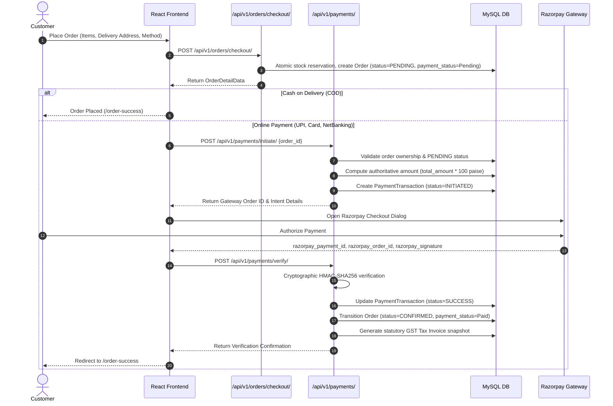
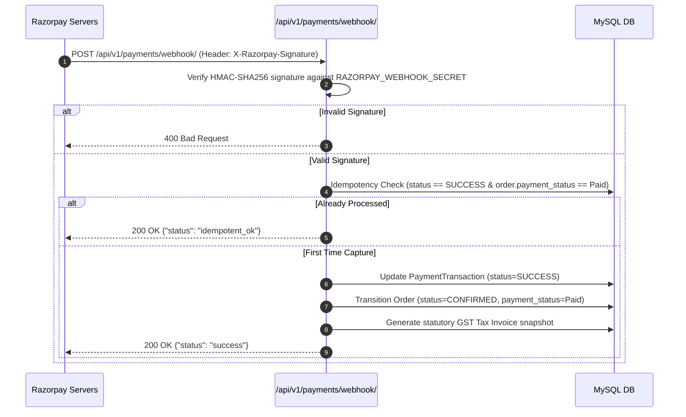

# Vee Power Electricals — Payment Gateway Integration Architecture (Razorpay)

## 1. Overview & Provider Decision

- **Provider**: **Razorpay** (Canonical Indian payment rail for Cards, UPI / QR, Net Banking, and B2B corporate purchasing).
- **Environment**: Multi-environment with sandbox/test mock fallback (`rzp_test_*`) and live production routing (`rzp_live_*`).
- **Core Security Principle**: Server-authoritative billing, cryptographic HMAC-SHA256 signature verification, strict data isolation, zero plaintext credential leakage.

---

## 2. Payment Flow Architecture



---

## 3. Asynchronous Webhook Architecture



---

## 4. Cryptographic Signature Verification

All client responses and asynchronous webhooks undergo server-side HMAC-SHA256 validation:

```python
# Payment Callback Signature Verification
expected_sig = hmac.new(
    RAZORPAY_KEY_SECRET.encode('utf-8'),
    f"{razorpay_order_id}|{razorpay_payment_id}".encode('utf-8'),
    hashlib.sha256
).hexdigest()

is_valid = hmac.compare_digest(expected_sig, razorpay_signature)
```

- **Timing-Attack Resistance**: Evaluated via `hmac.compare_digest`.
- **Authoritative Integrity**: Client cannot alter the payment ID, order ID, or transaction value.

---

## 5. Idempotency Guarantees

Both client `/verify/` and asynchronous `/webhook/` endpoints are strictly idempotent:
- Receiving duplicate `payment.captured` or `order.paid` webhooks produces **exactly one** order confirmation.
- Inventory is **never deducted twice**.
- Tax Invoices are **never duplicated**.
- Redundant calls return `idempotent_ok` with HTTP 200.

---

## 6. Failure & Exception Handling

- **Invalid Signature**:
  - PaymentTransaction record marked as `FAILED`.
  - Error code set to `INVALID_SIGNATURE`.
  - Order remains in `PENDING` payment state.
  - Client receives HTTP 400 Bad Request.
- **Payment Failed Webhook (`payment.failed`)**:
  - PaymentTransaction updated to `status=FAILED`.
  - Error code and gateway error description recorded for audit.
- **Cross-Customer Authorization**:
  - Attempting to initiate or verify payment for another user's order is rejected with HTTP 400/403.

---

## 7. Direct Refund Flow (Deferred Scope)

- **Status**: **Explicitly Deferred** for this release.
- **Business Rationale**: Return inspection, physical warehouse verification, and B2B credit notes remain canonical per business rules.
- **Implementation**: `PaymentGatewayService.process_refund` raises `NotImplementedError`.

---

## 8. Environment Variables

| Variable | Description | Default / Example |
| :--- | :--- | :--- |
| `RAZORPAY_KEY_ID` | Public merchant identifier | `rzp_test_mock_veepower_key` |
| `RAZORPAY_KEY_SECRET` | Secret key for order creation & signatures | `mock_veepower_secret_key_12345` |
| `RAZORPAY_WEBHOOK_SECRET` | Secret key for webhook validation | `mock_veepower_webhook_secret_67890` |

*Never commit real production keys into git repositories.*

---

## 9. Testing & Verification

- **Test Suite**: `backend/tests/test_payment_gateway.py` (19 comprehensive tests).
- **Coverage**:
  - Unauthenticated initiation / verification rejection (401)
  - Cross-customer order access rejection (400/403)
  - Authoritative server amount enforcement
  - Rejection of already-paid and cancelled orders
  - Valid cryptographic signature verification and order state transition
  - Tampered signature rejection and failure audit logging
  - Idempotent double verification
  - Asynchronous webhook capture, duplicate event idempotency, signature validation
  - Webhook payment failure recording
  - Order payment status retrieval
  - Zero plaintext secret leakage
  - Deferred refund verification
